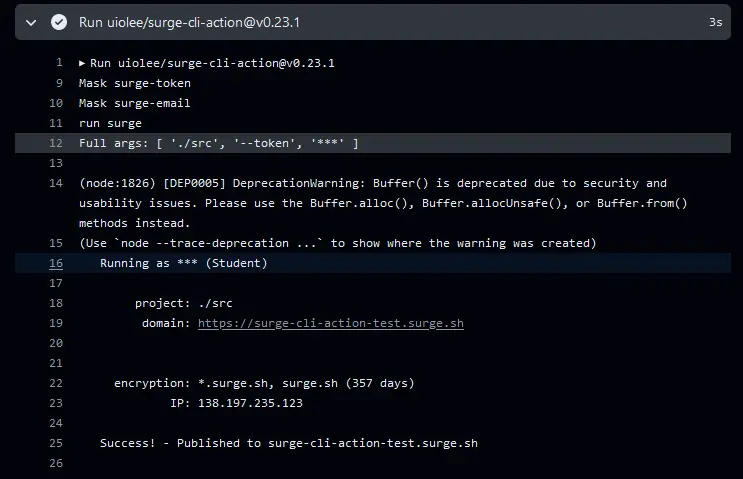

# surge-cli-action

Surge is bundled so you can use it directly without installing Surge via package manager.

## Usage

> [!IMPORTANT]
> This action have bundled [`surge`](https://www.npmjs.com/package/surge) package.
> So you didn't need `npm install surge`

```yml
- uses: uiolee/surge-cli-action@v0.23.1
  with:
    surge-args: "./dist https://test.surge.sh"
    surge-token: ${{ secrets.SURGE_TOKEN }}
    surge-email: ${{ secrets.SURGE_EMAIL }} # Just used to mask your email address to prevent it from being displayed in the log of workflow.
```

> The above action will be performed like the following command:
>
> ```bash
> surge ./dist https://test.surge.sh --token ${{ secrets.SURGE_TOKEN }}
> ```

### Example

<details>

<summary>uiolee/surge-cli-action-test</summary>

https://github.com/uiolee/surge-cli-action-test/blob/38e3c271117cfe1251b6b4432543259d2bf45d51/.github/workflows/deploy.yml#L36-L40



</details>

## Options

See [./action.yml](./action.yml)

## Versioning

This action does not use semver.

The version number of this action represents the version of the [surge](https://www.npmjs.com/package/surge) in the bundle.

Currently no plans to provide old versions.
